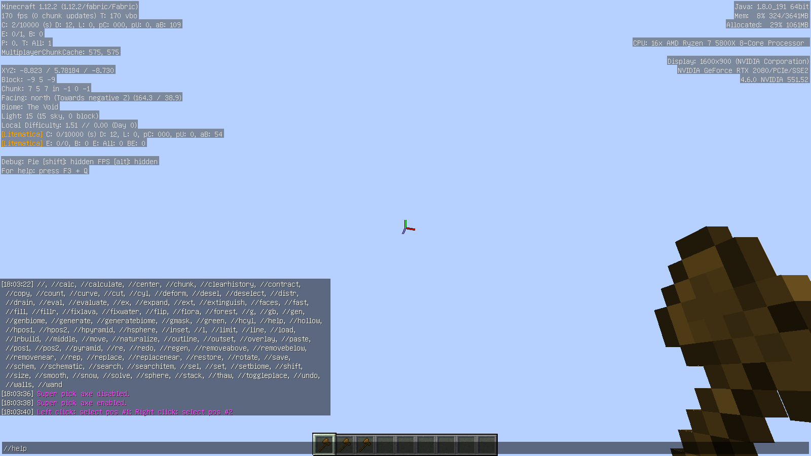

# WorldEditBridge

This mod makes [WorldEdit](https://enginehub.org/worldedit) works on Ornithe in Minecraft 1.12, with WorldEdit-CUI support.

This mod loads on [ornithe loader](https://ornithemc.net/).
To use this mod, simply download it from [modrinth](https://modrinth.com/mod/ornithe-worldeditbridge) and put it in `mods` folder.

GitHub [release](https://github.com/CrazyHPi/Ornithe-WorldEditBridge/releases) is still available tho.

WorldEdit itself is not needed, it's bundled in this mod.

## Credits

This mod origins from [carpetmod112](https://github.com/gnembon/carpetmod112), most credits go to carpet mod devs.

Mod logo by [KatouMegumii](https://github.com/KatouMegumii).